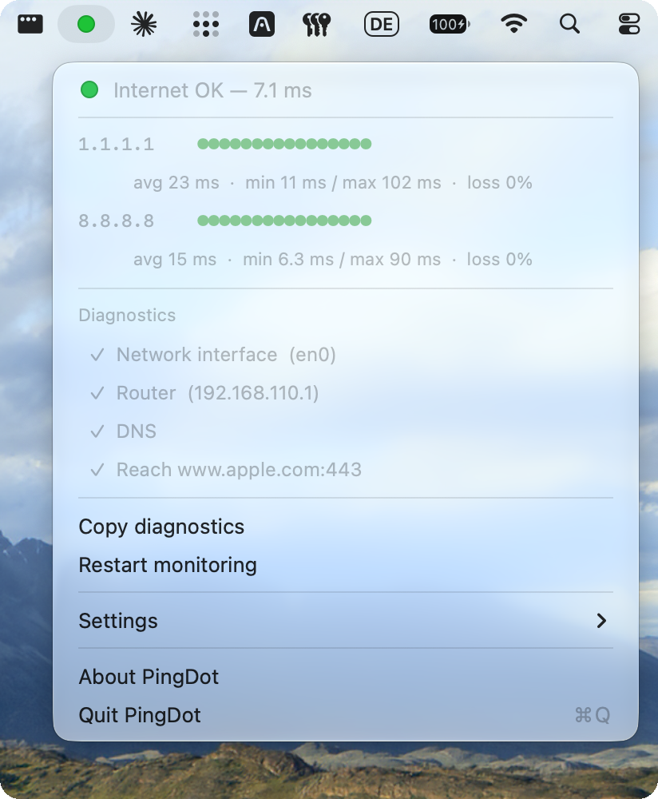
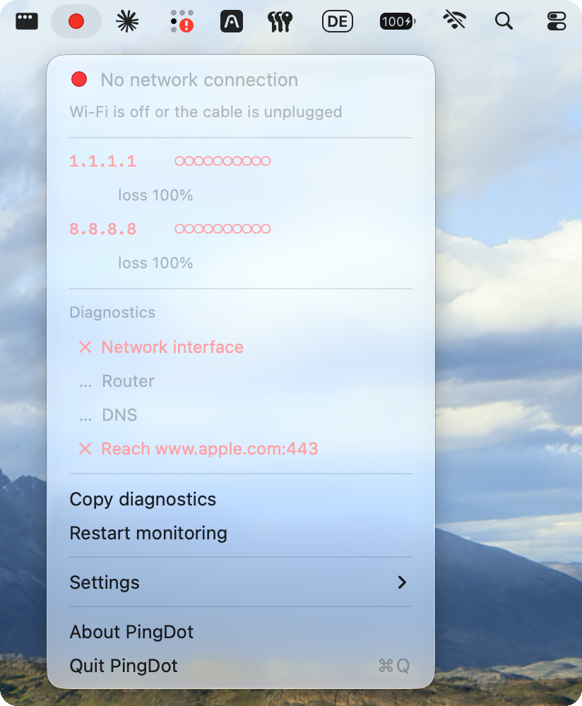
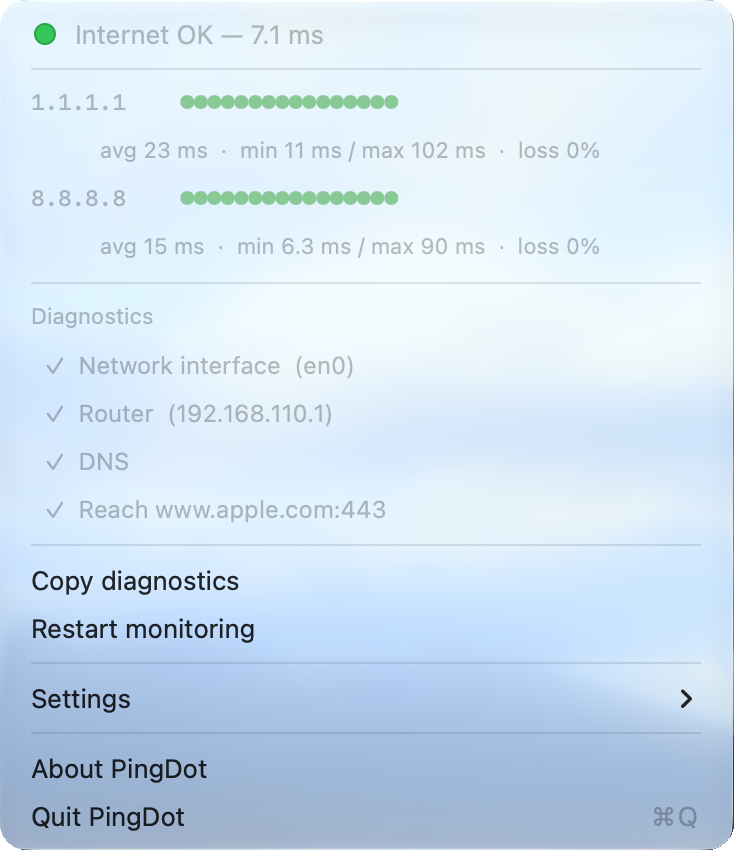

<p align="center">
  
</p>

<h1 align="center">PingDot</h1>

<p align="center">
  <strong>A dot in your Mac's menu bar that tells you whether the internet works.</strong>
  <br>
  <a href="https://www.schub.tech/labs/pingdot/">schub.tech/labs/pingdot</a>
</p>

<p align="center">
  <a href="https://github.com/schub-tech/pingdot/releases/latest"></a>
  
  
  <a href="LICENSE"></a>
</p>

<p align="center">
  
  
</p>

PingDot answers one question: is the app frozen, or is it my internet? One
glance at the top right instead of a terminal window running `ping` all day.

- **Green:** the last 10 pings came back.
- **Yellow:** packets are getting lost, or pings get through but websites won't
  load (DNS or HTTPS failing).
- **Red:** 3 pings in a row lost, or no network at all.

PingDot pings **1.1.1.1 (Cloudflare) and 8.8.8.8 (Google) in parallel** and only
turns red when both stop answering. If one provider has a bad day, the dot stays
green and the menu says *"8.8.8.8 unreachable — but you are online"*.

## Install

**Mac App Store:** coming soon.

**Homebrew:**

```sh
brew install schub-tech/tap/pingdot
```

**Download:** get `PingDot-<version>.zip` from the
[latest release](https://github.com/schub-tech/pingdot/releases/latest), unzip
it and move PingDot to Applications. The app is notarized by Apple.

Then turn on *Settings → Launch at login*. PingDot runs on Apple silicon and
Intel Macs with macOS 13 Ventura or later.

## When it helps

- **Video calls.** Zoom freezes and you want to know whether it's Zoom or your
  connection before you start apologising.
- **Train, hotel and café Wi‑Fi.** Connected, but nothing loads? PingDot shows
  whether the uplink is dead or a login page is waiting for you.
- **Phone hotspot.** See when the connection drops in a tunnel, and when it's back.
- **Home office.** The menu checks your router, DNS and a real HTTPS connection
  separately, so you know whether to restart the router or call your provider.
  *Copy diagnostics* gives you a text report for the support chat.
- **Ping works, websites don't.** When DNS fails while pings still get through,
  the dot turns yellow. A plain `ping` never catches this.
- **Office networks that block ping.** PingDot notices that the web works
  anyway, shows yellow instead of a false red and suggests switching to
  *TCP connect*.
- **Your own hosts.** Add your NAS, `fritz.box`, a VPN gateway or the company
  proxy as an extra target.

## What the menu shows

Click the dot for the details:

<p align="center">
  
</p>

Each target gets a row with its last 16 pings and the average, minimum, maximum
and loss. Below, the diagnostics check the network interface, your router, DNS
and an HTTPS connection to `www.apple.com`. When something is wrong, the line
under the headline names the likely cause, for example *"Router reachable,
internet not — provider outage or Wi‑Fi login page?"* or *"Wi‑Fi is off or the
cable is unplugged"*.

## Settings

Everything lives in the menu under *Settings*:

| | |
|---|---|
| **Targets** | 1.1.1.1 and 8.8.8.8 (default), 9.9.9.9, plus your own via *Add target…*, e.g. `fritz.box` or a company proxy. At least one stays on. |
| **Check every** | 500 ms, 1 s (default), 2 s or 5 s |
| **Method** | ICMP ping (default) or TCP connect |
| **Show latency in menu bar** | Round-trip time in ms next to the dot |
| **Use symbols instead of colours** | ✓, ! and ✕ instead of colours, for colour-blind users |
| **Launch at login** | Start automatically |
| **Check for updates** | Once a day, asks GitHub for a newer release and shows a line in the menu (GitHub and Homebrew version only) |

## Why it reacts fast

1. **One long-lived ICMP socket per target.** No `/sbin/ping` process every
   second, no output parsing. A ping costs one `sendto`, and the reply arrives
   on a dispatch read source. No root needed: PingDot uses unprivileged ICMP
   datagram sockets (`SOCK_DGRAM`/`IPPROTO_ICMP`), like Apple's SimplePing.
2. **Link state is instant.** `NWPathMonitor` reports a dropped Wi‑Fi or a pulled
   cable the moment it happens, so the dot turns red without waiting for timeouts.
3. **Diagnostics confirm before they warn.** Router, DNS and HTTPS are checked
   every 10 s and right after every network change. A failed DNS or HTTPS check
   only counts once a second check 3 s later fails too, so rejoining a Wi‑Fi
   doesn't flash yellow.

Idle cost: about 0.2 % CPU and 38 MB memory.

## Privacy

No tracking, no analytics, no account. PingDot talks to the targets you
configure (1.1.1.1 and 8.8.8.8 by default), your router, and `www.apple.com`
for the DNS and HTTPS checks. The GitHub and Homebrew version also asks GitHub
once a day whether there is a newer release; you can turn that off. Settings
stay on your Mac. Details in the [privacy policy](PRIVACY_POLICY.md).

## Build from source

You need macOS 13 or later and the Xcode Command Line Tools
(`xcode-select --install`). Releases are built with `Scripts/release.sh`, see
[docs/RUNBOOK.md](docs/RUNBOOK.md).

```sh
./Scripts/build-app.sh
open build/PingDot.app
```

Copy the app to `/Applications` before turning on *Launch at login*; login
items only work reliably from there.

To test without the menu bar:

```sh
swift build -c release
./.build/release/PingDot --selftest                     # the configured targets
./.build/release/PingDot --selftest 1.1.1.1 fritz.box   # any targets
```

The self-test measures ICMP and TCP against every target and shows what gets
through on the current network. If ICMP shows "no replies" and TCP "works",
switch to *Settings → Method → TCP connect*.

## Code layout

| File | |
|---|---|
| `ICMPPinger.swift` | ICMP echo over an unprivileged datagram socket |
| `TCPProbe.swift` | Fallback: times a TCP handshake |
| `NetworkMonitor.swift` | History, traffic-light logic, link state |
| `Diagnostics.swift` | Router, DNS and HTTPS checks |
| `StatusItemController.swift` | Menu bar item and menu |
| `StatusIcon.swift` | Draws the dot and the sparkline |
| `UpdateChecker.swift` | Daily release check (not in the App Store build) |
| `SelfTest.swift` | `--selftest` |
| `Scripts/build-app.sh` | Builds `build/PingDot.app` |
| `Scripts/package-zip.sh` | Also builds `build/PingDot.zip` for sharing |
| `Scripts/release.sh` | Signed releases for GitHub, Homebrew and the App Store |

## Contributing

Issues and pull requests are welcome. Please read
[CONTRIBUTING.md](CONTRIBUTING.md) first. Changes are listed in the
[changelog](CHANGELOG.md).

## Made by Schub

[Schub](https://www.schub.tech) is Munich's most selective accelerator. Build
with founders who've done it. Sometimes we build and publish experiments like
this one. Find more at [schub.tech/labs](https://www.schub.tech/labs/).

## License

MIT © [Schuon Technologies GmbH](https://www.schub.tech)
